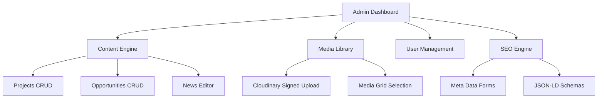

# Check-IN Portugal Redesign — Technical & Component Architecture

## 1. Directory Structure (Next.js 15 App Router)

We organize the codebase using a modern, scalable feature-based structure under the `/src` directory.

```
src/
├── app/
│   ├── (public)/                 # Public pages (with Lenis and default layout)
│   │   ├── layout.tsx            # Global layout with smooth scroll context
│   │   ├── page.tsx              # Animated Hero, Counter stats, Showcase
│   │   ├── sobre-nos/
│   │   │   └── page.tsx          # About Us timeline & team grid
│   │   ├── projetos/
│   │   │   ├── page.tsx          # Projects archive with filters
│   │   │   └── [slug]/
│   │   │       └── page.tsx      # Project detail pages (highly visual)
│   │   ├── oportunidades/
│   │   │   ├── page.tsx          # Active listings
│   │   │   └── [slug]/
│   │   │       └── page.tsx      # Application page & form
│   │   ├── galeria/
│   │   │   └── page.tsx          # Masonry grid & photo swipe lightbox
│   │   └── contacto/
│   │       └── page.tsx          # Interactive Map and Contact form
│   │
│   ├── admin/                    # CMS Administration Area
│   │   ├── layout.tsx            # Sidebar Navigation & User Session provider
│   │   ├── login/
│   │   │   └── page.tsx          # Centered Auth Screen (Glassmorphism layout)
│   │   ├── page.tsx              # Analytics dashboard & metrics overview
│   │   ├── projects/             # CRUD interface for Projects
│   │   ├── opportunities/        # CRUD interface + Applications tracking
│   │   ├── media/                # Drag-and-drop Cloudinary media library
│   │   └── settings/             # System settings & User Management
│   │
│   └── api/                      # Backend API Route Handlers
│       ├── auth/[...nextauth]/   # NextAuth authentication config
│       ├── projects/
│       ├── opportunities/
│       ├── media/                # Cloudinary upload signatures & actions
│       └── applications/         # Submit & update applications
│
├── components/                   # Reusable UI Architecture
│   ├── ui/                       # Shadcn UI low-level components (Buttons, Dialogs)
│   ├── animations/               # Animation wrappers (GSAP, Framer Motion)
│   │   ├── SmoothScroll.tsx      # Lenis Wrapper
│   │   ├── RevealText.tsx        # GSAP text line splitting
│   │   └── ParallaxImage.tsx     # ScrollTrigger image effect
│   ├── navigation/               # Sticky Nav, Mobile Menu & Footer
│   ├── public/                   # Shared public widgets (Project Card, Filter, Map)
│   └── admin/                    # CMS elements (Sidebar, Charts, Rich Text Editor)
│
├── hooks/                        # Custom React Hooks
│   ├── useGSAP.ts                # Animation life-cycle wrapper
│   └── useScrollDirection.ts     # Navigation hide-on-scroll
│
├── lib/                          # Services and Third-party Clients
│   ├── prisma.ts                 # Prisma Client singleton
│   ├── cloudinary.ts             # Cloudinary upload helpers
│   ├── seo.ts                    # Dynamic OpenGraph & Meta generator
│   └── utils.ts                  # Tailwind merge helper
│
└── types/                        # TypeScript Interfaces & Enums
```

---

## 2. Admin Panel & CMS Architecture

The administration area is designed as a standalone SPA-like interface nested under `/admin` with role-based routing.

### A. Role-Based Access Control (RBAC)
We enforce security controls inside Next.js Middleware and API route handlers:
*   **Super Admin:** Full system access, dashboard metrics, adding/deleting CMS users, changing roles, developer logs.
*   **Administrator:** Manage projects, opportunities, news, partners, and view applications. Cannot delete other administrators.
*   **Editor:** Add and modify news and gallery items.
*   **Project Manager:** Manage assigned opportunities and projects, process applications (accept/reject).

### B. Core CMS Modules



1.  **Rich Content Engine:** Implement a premium WYSIWYG editor (e.g., TipTap or Lexical) supporting image embeds, lists, and layout grids.
2.  **SEO & Schema Manager:** Form widgets dynamically integrated into content pages. Standardizes JSON-LD schema injection for search engines (e.g., `Event` schema for opportunities, `Article` schema for news, `NGO` schema for homepage).
3.  **Media Asset Manager:** Real-time upload interface. Rather than uploading directly to Next.js servers, client-side files are sent directly to Cloudinary using API-generated secure signature tokens, maintaining low server load and fast response times.

---

## 3. Security & Authentication Model

*   **Auth Provider:** NextAuth.js v5 using Credentials provider (email/password) backed by bcrypt password hashing.
*   **Session Token:** JWT encrypted with a high-entropy secret key.
*   **CSRF Prevention:** Automated token verification across POST/PUT/DELETE API endpoints.
*   **Rate Limiting:** Enforce API rate-limiting via Redis or Upstash on auth and application endpoints to mitigate DDoS and brute-force attempts.
