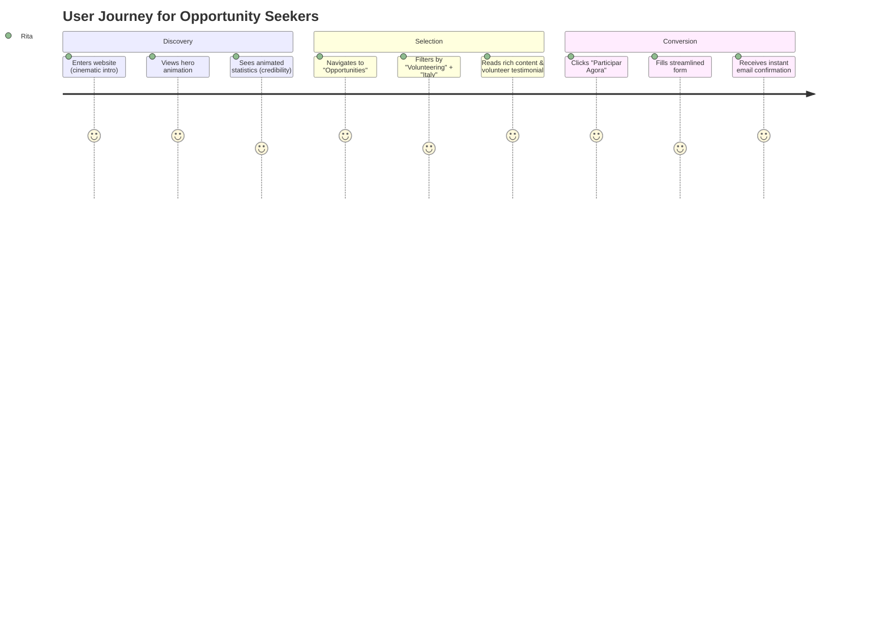

# Check-IN Portugal Redesign — UX Strategy & Sitemap

## 1. Executive Summary & Brand Positioning

Check-IN Portugal is a premier Portuguese non-profit organization facilitating international youth mobility, training courses, volunteering (ESC), and European cooperation projects (Erasmus+ KA1/KA2, CERV). 

The goal of this redesign is to transition from a generic, template-driven NGO website to a high-end, immersive digital product. The experience should build trust with European institutions, engage youth with visual storytelling, and position Check-IN as a forward-thinking, professional organization.

### Brand Values & Visual Analogues
*   **Aesthetic Mix:** Apple-level cleanliness, Stripe-level interactive details, Linear-style dark/light interface harmony, and Webflow Awards-level motion design.
*   **Keywords:** Professional, Connected, Cinematic, Transparent, Minimalist.

---

## 2. Target Audience & User Personas

### Persona A: The Aspiring Volunteer/Participant
*   **Profile:** Rita, 21, university student in Lisbon. Eager to travel, learn, and volunteer abroad but overwhelmed by complex bureaucratic European portals.
*   **Needs:** Easy discovery of open opportunities, simple filtering by country/duration/funding, and a frictionless application process.
*   **Friction Points:** Complex, dry jargon (KA1, KA2, CERV, ESC). We must translate these into plain language filters (e.g., "Voluntariado", "Cursos de Formação", "Intercâmbios de Jovens").

### Persona B: Institutional Partners & Municipalities
*   **Profile:** Dr. Manuel, 45, representative of a municipal chamber or European university. Looking to collaborate on a Erasmus+ KA2 capacity-building project.
*   **Needs:** Validation of Check-IN's experience, impact metrics, audit-friendly project reporting, and verification of quality standards.
*   **Friction Points:** Lack of transparent statistics and clear results. We address this with an animated, verified impact section.

### Persona C: The Internal Team (Admin & Project Managers)
*   **Profile:** Sofia, 32, Project Coordinator at Check-IN.
*   **Needs:** Fast publishing of open calls, drag-and-drop media uploads for galleries, role-based editing, and structured SEO management for funding visibility.

---

## 3. User Journey Map (Opportunities Discovery & Application)



---

## 4. Sitemap Architecture

```
/ (Homepage)
├── Sobre Nós (About Us)
│   ├── Equipa (Team)
│   └── Qualidade & Parcerias (Quality & Standards)
├── Projetos (Projects Showcase)
│   ├── [Slug] (Project Detail Page)
│   └── Arquivo de Projetos (Projects Archive)
├── Oportunidades (Opportunities Portal)
│   ├── [Slug] (Opportunity Details & Apply Page)
│   └── Formulário de Candidatura (Application Form)
├── Notícias & Eventos (News & Events)
│   └── [Slug] (Article Page)
├── Histórias (Volunteer & Success Stories)
│   └── [Slug] (Case Study / Photo-Video Journal)
├── Galeria (Masonry Media Gallery)
│   └── Lightbox Viewer
├── Contactos (Contact & Map)
└── Admin Portal (/admin)
    ├── Login (/admin/login)
    ├── Dashboard (/admin/dashboard)
    ├── Projetos (/admin/projects)
    ├── Oportunidades (/admin/opportunities)
    ├── Media Library (/admin/media)
    └── Utilizadores & SEO (/admin/settings)
```
